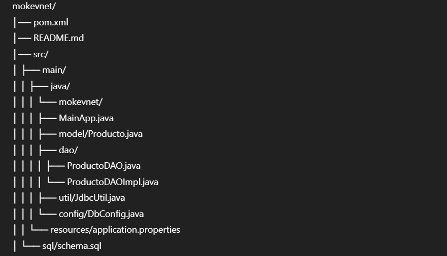

# Codificación de Módulos del Software – Evidencia GA7-220501096-AA2-EV01
Proyecto desarrollado en Java + Maven + JDBC

Este repositorio consolida la implementación del módulo solicitado en la evidencia de desempeño **GA7-220501096-AA2-EV01**, en el marco del componente formativo *Construcción de aplicaciones con Java*.  
El objetivo es materializar un módulo funcional, conectado a base de datos, alineado con estándares de codificación y gestionado bajo control de versiones.

---

## 🎯 Objetivo del Módulo
Construir un módulo software que gestione entidades del proyecto (en este caso, **Producto**) aplicando prácticas modernas de desarrollo Java:

- JDBC para conexión a base de datos
- CRUD completo
- Arquitectura organizada por paquetes
- DAO Pattern
- Proyecto estructurado con Maven
- Versionamiento Git + GitHub

Este módulo representa la base operativa para extender el sistema completo del proyecto formativo.

---

## 🧩 Estructura del Proyecto
El proyecto sigue el estándar Maven, garantizando escalabilidad y mantenimiento a largo plazo:

Cada paquete cumple un rol específico dentro del ciclo de construcción del software.

---

## 🛢 Conexión a Base de Datos (JDBC)
La conexión se gestiona desde la clase:

mokevnet/util/JdbcUtil.java

Incluye:

- Driver JDBC
- URL de conexión
- Autenticación
- Manejo seguro de excepciones
- Compatibilidad con MySQL

Además, la carpeta **sql/** incorpora el archivo `schema.sql` para replicar la estructura de la tabla utilizada.

---

## ⚙️ Funcionalidades Implementadas (CRUD)
El módulo implementa todas las operaciones solicitadas:

### ✔ Crear
Inserta nuevos productos en la base de datos.

### ✔ Consultar
Permite consultar un producto por ID y listar todos.

### ✔ Actualizar
Modifica campos del producto.

### ✔ Eliminar
Elimina registros por ID.

Estas operaciones están contenidas en:

mokevnet/dao/ProductoDAOImpl.java

Aplicando el patrón DAO para desacoplar lógica de negocio y acceso a datos.

---

## 🧪 Ejecución del Módulo
1. Configurar base de datos usando `schema.sql`
2. Ajustar credenciales en `application.properties`
3. Ejecutar desde IntelliJ o terminal:

mvn clean install
mvn exec:java -Dexec.mainClass="mokevnet.MainApp"

---

## 🛠 Herramientas Utilizadas
- **Java 17**
- **Maven**
- **JDBC**
- **MySQL**
- **IntelliJ IDEA**
- **Git + GitHub**

---

## 📂 Versionamiento del Proyecto
Todo el proceso de construcción se gestionó mediante:

- `git init`
- commits organizados
- control de cambios
- push al repositorio remoto

Repositorio oficial:

https://github.com/kevinCoperd/evidencia-GA7-220501096-AA2-EV01

---

## 🏁 Conclusión
El módulo cumple con:

- Requerimientos funcionales
- Estándares de codificación
- Estrategia de empaquetado Maven
- Buenas prácticas de construcción en Java
- Gestión de versiones en Git

Este entregable se integra como componente clave dentro del proyecto de software definido en el programa de formación.
